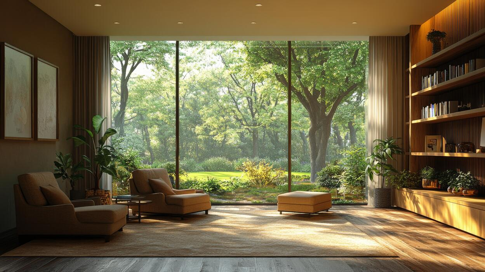

# August & Ash — Interior Design Studio Website

A fictional boutique interior design studio, built as a demo/portfolio site. Dark,
editorial "luxury" design system: warm charcoal canvas, brass/gold accent, Fraunces
serif for display type paired with Inter for body copy.

Everything — business name, founder, projects, testimonials, contact details — is
invented for this build. Swap in real content before using it for an actual business.

## Run locally

Open `index.html` directly in a browser, or serve it:

```
python3 -m http.server 8000
```

Then visit http://localhost:8000

## Files

- `index.html` — page structure and copy
- `styles.css` — design system tokens + components
- `script.js` — scroll nav state, mobile menu, contact form handler
- `assets/images/` — drop real photos here (see below for what's needed)

## Adding real photos

Every photo on the page is currently a styled placeholder block (gradient +
caption) generated purely in CSS via `.photo-placeholder`, so the site works
with zero images. Each placeholder's caption names the exact file it expects.
To swap one in, replace the placeholder `<div>` with an `` pointing at
your file, e.g.:

```html
<!-- before -->
<div class="hero-photo photo-placeholder" data-caption="hero.jpg — ..."></div>

<!-- after -->
<div class="hero-photo">
  
</div>
```

### Shot list (14 images)

| Done | Count | Location | Spec |
|---|---|---|---|
| ✅ | 1 | `assets/images/hero.jpg` | Hero. Wide/landscape, a full styled room with strong natural light — the single most striking shot you have. |
| ✅ (1 of 9) | 9 | `assets/images/portfolio/project-{1,2,3}-0{1,2,3}.jpg` | 3 per project (3 projects). Per project: 1 wide room shot (living/dining/kitchen) + 1–2 detail or vignette shots (styling, textures, a corner). `project-1-01.jpg` is filled; `project-1-02.jpg` and all of projects 2–3 are still placeholders. |
| ✅ | 1 | `assets/images/about/founder.jpg` | Portrait orientation. A person (designer) in a studio or on-site setting — can be a stand-in/stock portrait since the founder is fictional. |
| ⬜ | 3 | `assets/images/details/detail-{1,2,3}.jpg` | Portrait/square. Close-up texture shots — fabric swatches, materials, a styled tablescape or shelf — used as a decorative strip between sections. |

General guidance: landscape/wide shots for hero and portfolio, portrait for the
founder and detail strip; at least 1600px on the long edge (2400px+ for the
hero); consistent warm, natural-light color grading works best against the
dark charcoal background.

## Known placeholders — update before launch

- **Photos** — see above.
- **Contact details** — email/Instagram/hours are invented; not real, functioning
  contacts.
- **Testimonials** — clearly fictional, flagged inline as placeholder quotes.
- **Contact form** — submits nothing (`script.js` just shows a confirmation message).
  Wire it to an email service, formspree-style endpoint, or backend before going live.
